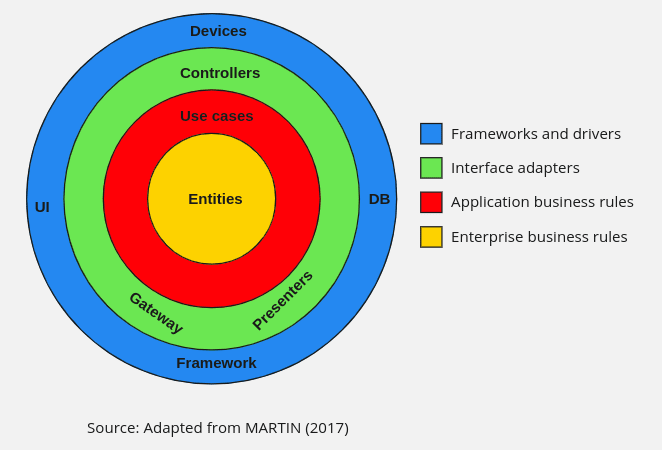

# Chuck Norris Gateway API

Micro serviço para integração com API do Chuck Norris

## Tecnologias Utilizadas

**Node.js:** Plataforma de execução de código JavaScript do lado do servidor.

**NestJS/Fastify:** Framework para construção de aplicativos Node.js escaláveis e eficientes.

**Clean Architecture:** Abordagem arquitetural que visa separar as preocupações em camadas distintas para facilitar a manutenção e testabilidade do código.

## Estrutura do Projeto

A estrutura do projeto segue a filosofia da Clean Architecture com Clean Code, com as seguintes camadas:

**Common:** Arquivos e configurações de uso comum para toda aplicação.

**Constants:** Inicializa variaveis de ambiente.

**Modules:** Contém cada domínio com suas responsabilidades divididas.

**Application/UseCase:** Trata da avaliação de regras de negócio e tomada de decisão. Eles contêm as regras que dão sentido à aplicação. Os casos de uso direcionam o fluxo para as entidades e as orquestram para realizar o negócio.

**Domain:** responde ao modelo de dados da aplicação, serviços de domínio, interfaces, etc. Entidades são os modelos definidos que interagem no sistema; eles devem ser abstratos o suficiente para serem usados ​​por vários aplicativos no negócio. Contém DTOs, mappers, models e entidades principais da aplicação.

**Infra:** São os elementos externos com os quais a aplicação se comunica, tanto de entrada quanto de saída:
**- Pontos de entrada:** Uma API com REST ou GraphQL, mensagens com RabbitMQ ou via linha de comando, etc.
**- Pontos de saída:** Um banco de dados relacional com PostgreSQL, não relacional com MongoDB, ou também envio de mensagens com RabbitMQ, etc.

```
├── src
│   ├── common
│   ├── constants
│   └── modules
│       └── name-module
│           ├── application
│           └── domain
│           └── infra
└── ...
```

<br/>



## Como iniciar a aplicação

Executando a aplicação:

Copie o arquivo env para desenvolvimento local

```bash
cp .env{.example,}
```

```bash
npm ci
npm run start:dev
```

Testando

```bash
curl http://localhost:3000/healthcheck
curl http://localhost:3000/healthcheck/complete
curl http://localhost:3000
```

## SWAGGER

URL: <http://localhost:3000/docs>
